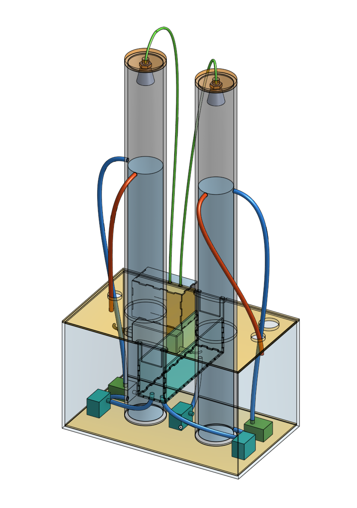

# CLAIRE water management demonstrator
This repo holds the source code for the Arduino Library implemented for use by students and researchers to apply controllers to a model of two rain-water basins (illustrated by the tubes). 
The environment fills the basins, and the goal is to maximise the level in the tubes to increase sedimentation before discharging the water for later water-works, while minimising the risk of an overflow.
The controller knows the forecast, the level of the basin(s), and can choose to discharge some amount.

To model this, each tube has an inflow- and outflow-pump along with an ultrasonic sensor to measure with mm-precision the height of the water column. This is exposed with an interface to the user for control.

## Usage
Install the library from the Arduino Library Manager by searching for 'CLAIRE'.

See `Basic.ino` example bundled with the library for getting started.

```c
#include "Claire.h"

// use default definitions of pumps and sensors of reference physical implementation
using namespace default_pump_defs;
using namespace default_sensor_defs;

Claire claire = Claire();

void setup() {
  // set debug to be verbose in output
  claire.DEBUG = true;

  // setup 9600 baud for serial connection
  Serial.begin(9600);

  claire.begin();
}

void loop() {
  bool ok;
  
  // get height of water column in tube0
  int tube0_height = claire.getRange(TUBE0_HEIGHT);

  // pump with 100% flow into tube0 for five seconds
  ok &= claire.setPump(TUBE0_IN, 100);
  delay(5000);
  ok &= claire.setPump(TUBE0_IN, 0);

  Serial.println("Tube0 gained " + String(tube0_height - claire.getRange(TUBE0_HEIGHT)) + " mm of water");

  digitalWrite(LED_BUILTIN, !ok);
  delay(5000);
}
```

## CAD model

